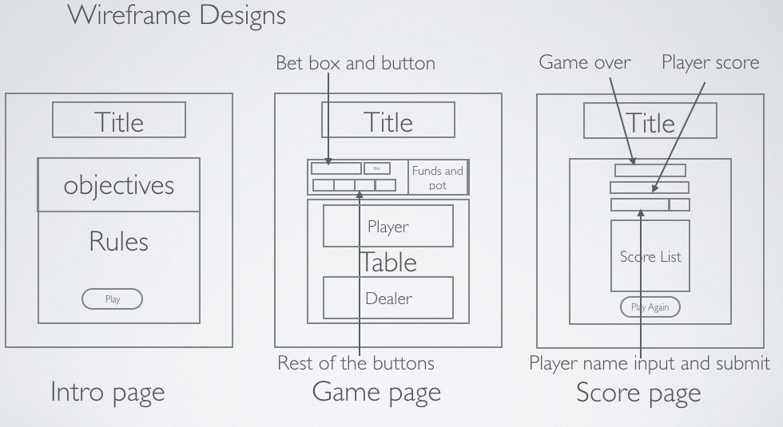
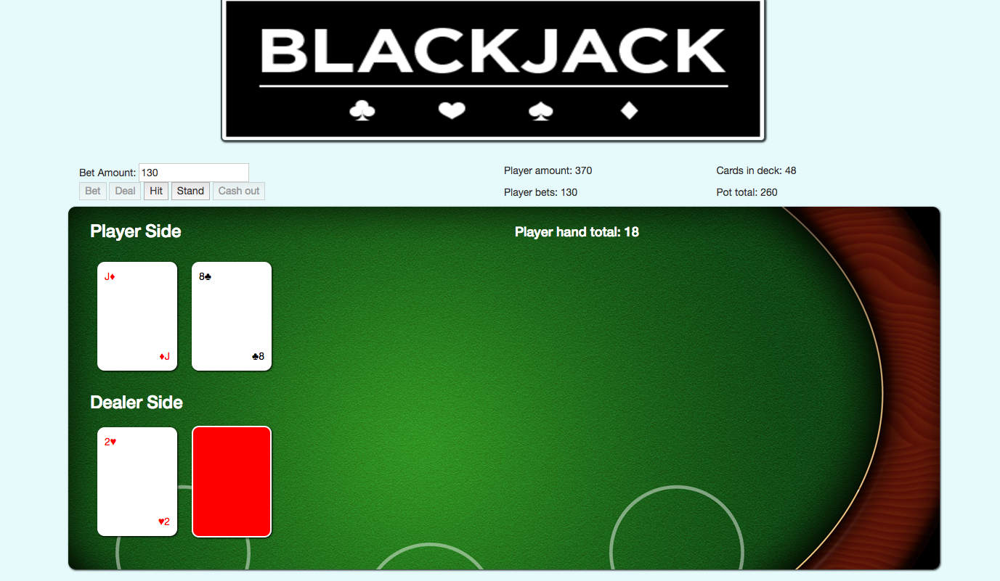

# Sparta-Core-Project-1

## Blackjack
### Table of contents

1. [Introduction](#introduction)
2. [Requirements](#requirements)
3. [Design](#design)
4. [Approach](#approach)
	* [Challenges](#challenges)
	* [Things that went well](#well)
5. [How to play](#play)
	* [Rules](#rules)
	* [Screenshot](#screenshot)

## Introduction
I was to design and implement a browser based game, HTML, CSS and JS was to be used to implement this project. The game I decided to implement was blackjack. 
### Languages
* HTML along with bootstrap was used as the  foundations to position the elements of my game as how the game would look. 
* CSS was used to style the HTML to how things would look as well as colours used, CSS was also used for minor position tweaks for the elements such as centering.
* JS was used for the entire logics of the game, DOM was used to interact with the elements from the HTML. Based on the interactions certain elements are created along with different outcomes.

## Requirements
* Player is able to place bets and see their funds.
* Player is able to deal which provides player and dealer with 2 cards each.
* Player is able to hit to draw a card.
* Player is able to stand to stay with current hand.
* Player is able to see cards faced up or down on table.
* Player is able to cash out to end game and submit their name along with score.
* Player is able to see where they score on the score board based on score.
* player is able to play again.

## Design

1. There consist of 3 wireframe designs for each page. The first page welcomes the user to the game as well as explaining the objectives and rules of the game. 
2. The second page consists of the game itself contianing much of the elements to interact with the JS, the player is able to see cards on the both the player and dealer side and place cards with the hit button. 
3. The third page is the score page where the player can see their final score as well as submitting their name. Once they submitted their name it will then placed them on the scoreboard dependant on their score.

## Approach
Scrum was used to manage and break the developement of the game into 3 cycles. Each cycle is a sprint lasting for 2 days long, each sprint have a set of goals to accomplish and by the end of the final sprint the game is complete.

1. **Sprint 1** - In sprint 1 a bare minimum working game was implemented containing the majority of the game logic and outputting it to the HTML elements for the player to see.
2. **Sprint 2** - In sprint 2, the design of the front and game page was implemented in HTML along with the table and card outputs of both player and dealer. The output of the player funds and pot is implemented for player to keep track of funds to bet.
3. **Sprint 3** - In sprint 3, design and implementation of the score page which the cash out links to, user is able to see final score and input name to display on score list. Sound is implemented at the end along with score sorting.

##### Challenges
* One of the main challenge was the implementation of the card elements to be displayed on the HTML side.
* Another challenge was making the cards face down for the dealer side and having the cards face up for player side. 

##### Things that went well
* Everything in the code is implemented as a function, this meant that any tweaks and changes made only affects that function making the code easy to modify.
* Players and cards have a constructor to implement the objects when they are needed. 
* A deck array is used to store the card objects made which meant the function could be reused in any other card based game.

## How to play

To play game [press here](https://lauw26.github.io/Sparta-Core-Project-1/) 
 The objective of the game is to obtain as much money as you can before all the cards are played from the deck. When player cash hits 0, the deck has less than 9 cards or player presses cash out, the current game match ends and the amount of cash left is the player's overall score. 
Deal is used at the start to provide player and dealer with 2 cards, using hit to get an extra card or stand to stay with hand afterwards.

### Rules
* Player closest to 21 is determined as winner
* Player must place a bet between 1 to the amount player current have.
* Ace is worth 1 and J,Q,K is worth 10
* When tie player reclaims cash placed in pot
* If both player and dealer are busted then dealer is determined as the winner

### Screenshot of gameplay

[Back to top](#top)